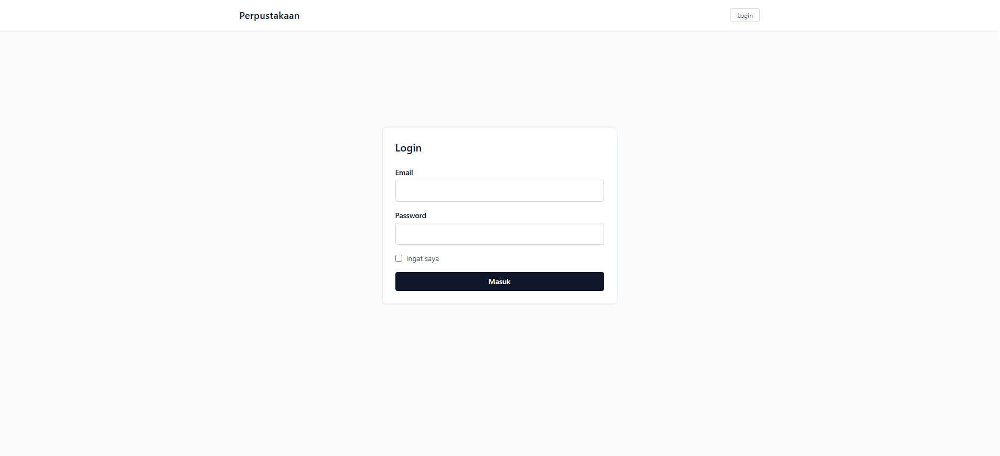
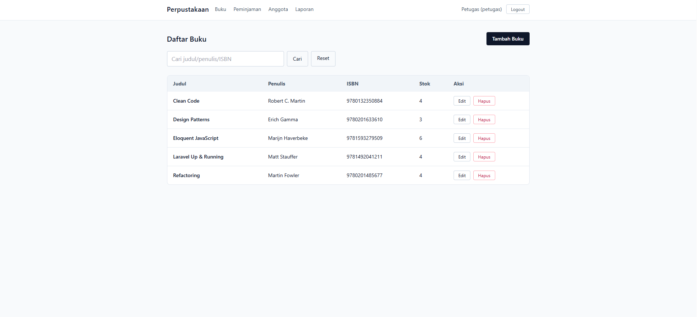
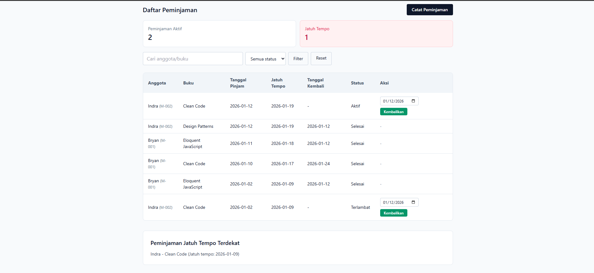
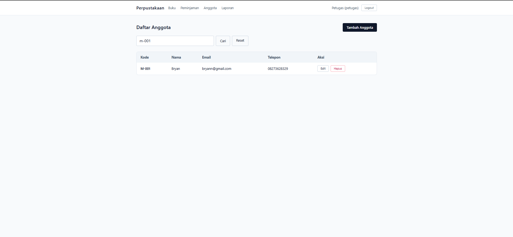
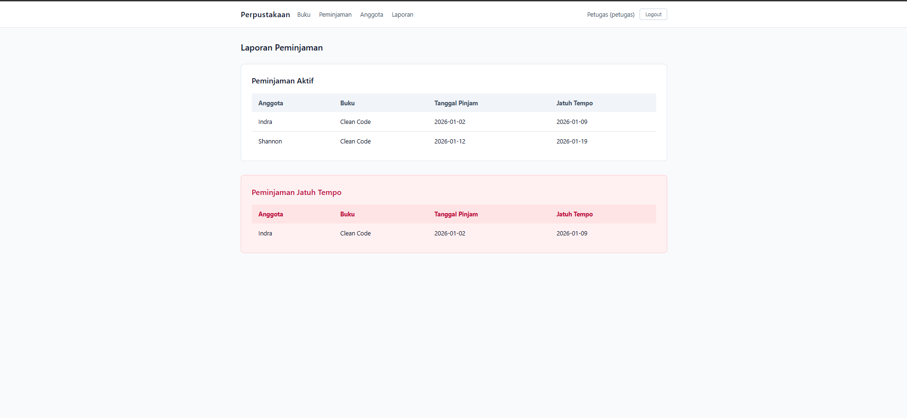

# Dokumentasi Sistem Perpustakaan (Laravel)

## Ringkasan
Aplikasi web untuk mengelola katalog buku dan pencatatan peminjaman. Pengguna dibagi menjadi petugas dan anggota. Petugas mengelola data, anggota hanya melihat dan memantau peminjaman miliknya. Aplikasi dibuat dengan Laravel (PHP) dan MySQL, dengan antarmuka Tailwind via CDN (Content Delivery Network).

## Fitur Utama
- Login petugas dan anggota + logout.
- Hak akses berbasis peran (petugas vs anggota).
- Buku: daftar + pencarian (judul/penulis/ISBN), tambah, ubah, hapus.
- Anggota: daftar + pencarian (nama/kode/email), tambah, ubah, hapus.
- Peminjaman: daftar + filter status (aktif/kembali/terlambat) + pencarian.
- Peminjaman (petugas): catat pinjam, catat kembali, jatuh tempo otomatis +7 hari.
- Stok buku otomatis berkurang saat pinjam dan bertambah saat kembali.
- Laporan peminjaman aktif dan terlambat (petugas).

## Database dan Diagram
Skema tabel utama:

users
- id (BIGINT, PK)
- name (VARCHAR)
- email (VARCHAR, UNIQUE)
- password (VARCHAR)
- role (VARCHAR, default: anggota)
- member_code (VARCHAR, UNIQUE, NULLABLE)
- phone (VARCHAR, NULLABLE)
- address (TEXT, NULLABLE)
- remember_token (VARCHAR, NULLABLE)
- created_at, updated_at (TIMESTAMP)

books
- id (BIGINT, PK)
- title (VARCHAR)
- author (VARCHAR)
- isbn (VARCHAR, UNIQUE, NULLABLE)
- publisher (VARCHAR, NULLABLE)
- year (SMALLINT, NULLABLE)
- stock (INT, default: 0)
- created_at, updated_at (TIMESTAMP)

loans
- id (BIGINT, PK)
- user_id (BIGINT, FK -> users.id)
- book_id (BIGINT, FK -> books.id)
- loan_date (DATE)
- due_date (DATE)
- return_date (DATE, NULLABLE)
- created_at, updated_at (TIMESTAMP)

sessions (opsional, jika memakai driver database)
- id (VARCHAR, PK)
- user_id (BIGINT, NULLABLE)
- ip_address (VARCHAR, NULLABLE)
- user_agent (TEXT, NULLABLE)
- payload (LONGTEXT)
- last_activity (INT)

Relasi:
- loans.user_id -> users.id (1 user banyak peminjaman).
- loans.book_id -> books.id (1 buku banyak peminjaman).

ERD: ada di `docs/ERD DIAGRAM.drawio.xml`.


## Project Structure
```
app/                                             # Sumber utama aplikasi (MVC)
  Http/Controllers/                              # Controller: alur request/response
    AuthController.php                           # Login/logout
    BookController.php                           # CRUD buku
    LoanController.php                           # Peminjaman/pengembalian
    MemberController.php                         # CRUD anggota
  Models/                                        # Model Eloquent (tabel + relasi)
    Book.php                                     # Tabel books + relasi loans
    Loan.php                                     # Tabel loans + relasi user/book
    User.php                                     # Tabel users + autentikasi
  Services/
    BookService.php                              # Logika bisnis buku
config/
  app.php                                        # Konfigurasi umum (locale, timezone)
  auth.php                                       # Guard/provider autentikasi
  session.php                                    # Konfigurasi session
database/
  migrations/
    2026_01_10_175502_create_users_table.php     # Struktur tabel users
    2026_01_10_175503_create_books_table.php     # Struktur tabel books
    2026_01_10_175503_create_loans_table.php     # Struktur tabel loans
    2026_01_10_180515_create_sessions_table.php  # Struktur tabel sessions
  seeders/
    BookSeeder.php                               # Data contoh buku
    DatabaseSeeder.php                           # Seeder utama (memanggil lainnya)
resources/
  views/
    auth/login.blade.php                         # Halaman login
    books/                                       # Halaman buku
    loans/                                       # Halaman peminjaman
    members/                                     # Halaman anggota
    layouts/app.blade.php                        # Layout utama
routes/
  web.php                                        # Routing web
public/                                          # Aset publik (CSS/JS/IMG)
docs/
  screenshots/                                   # Screenshot aplikasi
  ERD DIAGRAM.drawio.xml                          # File ERD (Draw.io)
  ERD.drawio.png                                 # Gambar ERD
README.md                                        # Dokumentasi utama
testcase-full.md                                 # Test case lengkap
testcase.md                                      # Test case business logic
artisan                                          # CLI Laravel
```

## Metode Pengembangan
- Metode: Waterfall.
- Alasan: kebutuhan relatif jelas, scope kecil, waktu pengerjaan singkat.
- Tahap: Analisis -> Desain -> Implementasi -> Pengujian -> Dokumentasi.

## Lingkungan Pengembangan
- IDE: Visual Studio Code.
- Runtime lokal: Laragon.
- Bahasa/Framework: PHP + Laravel.
- DBMS: MySQL.

## Requirement / Dependensi
- PHP 8.2+.
- Composer.
- MySQL.
- Laragon (untuk server lokal).
- Browser modern (Chrome/Edge/Firefox).
- Node.js hanya diperlukan jika ingin menggunakan tooling frontend tambahan (opsional).

## Cara Menjalankan
1. Install dependency:
   ```bash
   composer install
   ```
2. Salin `.env` dan atur koneksi database:
   ```bash
   cp .env.example .env
   ```
   Contoh isi:
   ```text
   DB_CONNECTION=mysql
   DB_HOST=localhost
   DB_PORT=3306
   DB_DATABASE=library_app
   DB_USERNAME=root
   DB_PASSWORD=
   ```
3. Generate app key:
   ```bash
   php artisan key:generate
   ```
4. Jalankan migrasi:
   ```bash
   php artisan migrate
   ```
5. Jalankan seeder (akun petugas + data buku contoh):
   ```bash
   php artisan db:seed
   ```
6. Buka aplikasi:
   - Laragon: `http://library-app.test`
   - Atau: `php artisan serve`

## Akun Login
- Petugas: `petugas@example.com` / `password`.
- Anggota: dibuat oleh petugas dari menu Anggota.

## Dokumen Pengujian
- Test case lengkap: [testcase-full.md](testcase-full.md).

## Screenshot
- Login
  
- Daftar Buku (admin)
  
- Daftar Peminjaman (admin)
  
- Daftar Anggota (admin)
  
- Laporan Peminjaman
  

## Alur Singkat
1. Petugas login.
2. Petugas menambah data buku.
3. Petugas mencatat peminjaman:
   - `loan_date` otomatis tanggal hari ini.
   - `due_date` otomatis +7 hari.
4. Petugas mencatat pengembalian (mengisi `return_date`).
5. Anggota login dan melihat peminjaman miliknya.

## Contoh 4 Pilar OOP (dari kode proyek)
- Encapsulation: contoh lengkap dari `app/Models/Book.php` (data `fillable` dibatasi di dalam class).
  ```php
  <?php

  namespace App\Models;

  use Illuminate\Database\Eloquent\Factories\HasFactory;
  use Illuminate\Database\Eloquent\Model;

  class Book extends Model
  {
      use HasFactory;

      protected $fillable = [
          'title',
          'author',
          'isbn',
          'publisher',
          'year',
          'stock',
      ];

      public function loans()
      {
          return $this->hasMany(Loan::class);
      }
  }
  ```
- Inheritance: `BookController extends Controller` dan `User extends Authenticatable` (`app/Http/Controllers/BookController.php`, `app/Models/User.php`).
- Polymorphism: method dengan nama sama di controller berbeda (mis. `store()` pada `BookController`, `MemberController`, `LoanController`) memiliki implementasi berbeda.
- Abstraction: Eloquent ORM menyederhanakan akses database, mis. `Book::create(...)` tanpa SQL manual.

## Debugbar (Opsional)
Jika ingin menampilkan bar debug di bawah halaman:
1. Install package:
   ```bash
   composer require barryvdh/laravel-debugbar --dev
   ```
2. Pastikan `.env`:
   ```text
   APP_DEBUG=true
   ```
3. Reload halaman.
