# Dokumen Uji (Testcase Lengkap)

Laporan pengujian manual untuk Sistem Manajemen Perpustakaan.

---

## Ringkasan Uji

| Metric | Value |
|--------|-------|
| **Total Test Case** | 28 |
| **Lulus (PASS)** | 28 |
| **Gagal (FAIL)** | 0 |
| **Persentase Lulus** | **100%** |

---

## Kelompok Uji

### 1. Authentication (4 tests)
- Login berhasil (petugas)
- Login berhasil (anggota)
- Login gagal (email/password salah)
- Logout

### 2. User Interface (2 tests)
- Home page rendering
- Navigasi menu sesuai role

### 3. Book Catalog (5 tests)
- Lihat daftar buku
- Pencarian buku (judul/penulis/ISBN)
- Tambah buku (petugas)
- Edit buku (petugas)
- Hapus buku (petugas)

### 4. Loan Management (8 tests)
- Catat peminjaman (petugas)
- Validasi peminjaman (stok habis)
- Daftar peminjaman (petugas)
- Filter status (aktif/selesai/terlambat)
- Pengembalian buku
- Stok bertambah setelah pengembalian
- Daftar peminjaman anggota (anggota)
- Laporan peminjaman (petugas)

### 5. Member Management (5 tests)
- Lihat daftar anggota
- Cari anggota
- Tambah anggota
- Edit anggota
- Hapus anggota

### 6. Report (2 tests)
- Laporan peminjaman aktif
- Laporan peminjaman jatuh tempo/terlambat

### 7. Business Logic (2 tests)
- Due date otomatis +7 hari saat pinjam
- Tanggal kembali tidak boleh sebelum tanggal pinjam

---

## Rincian Test Case

### TC-AUTH-01: Login Berhasil (Petugas)

**Prioritas:** High  
**Jenis:** Functional

**Kondisi Awal:**
- Akun petugas tersedia.

**Langkah Uji:**
1. Buka halaman Login.
2. Masukkan email petugas dan password.
3. Klik "Masuk".

**Hasil yang Diharapkan:**
- Login berhasil.
- Dialihkan ke halaman Home.
- Menu petugas (Buku/Anggota/Peminjaman/Laporan) tampil.

**Bukti:**
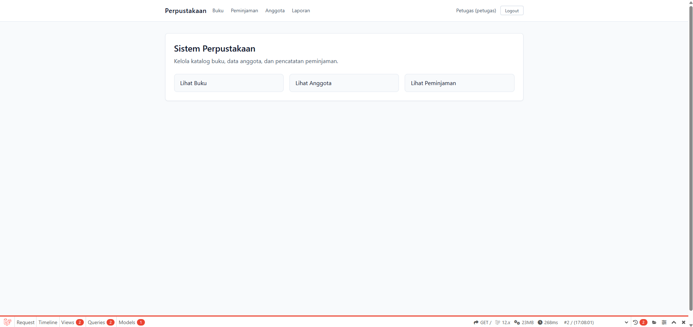

**Status:** PASS

---

### TC-AUTH-02: Login Berhasil (Anggota)

**Prioritas:** High  
**Jenis:** Functional

**Kondisi Awal:**
- Akun anggota tersedia.

**Langkah Uji:**
1. Buka halaman Login.
2. Masukkan email anggota dan password.
3. Klik "Masuk".

**Hasil yang Diharapkan:**
- Login berhasil.
- Menu anggota hanya tampil Buku & Peminjaman.

**Bukti:**
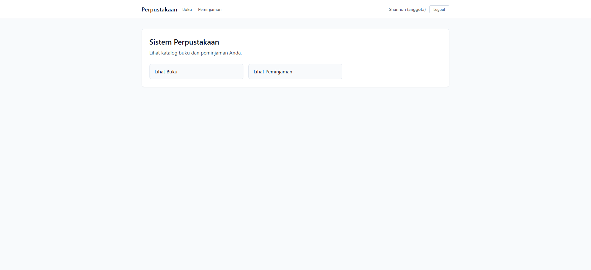

**Status:** PASS

---

### TC-AUTH-03: Login Gagal (Email/Password Salah)

**Prioritas:** High  
**Jenis:** Functional

**Kondisi Awal:**
- Akun tidak valid.

**Langkah Uji:**
1. Buka halaman Login.
2. Masukkan email/password salah.
3. Klik "Masuk".

**Hasil yang Diharapkan:**
- Muncul pesan error login.
- Tetap di halaman login.

**Bukti:**

**Status:** PASS

---

### TC-AUTH-04: Logout

**Prioritas:** Medium  
**Jenis:** Functional

**Kondisi Awal:**
- User sudah login.

**Langkah Uji:**
1. Klik tombol "Logout".

**Hasil yang Diharapkan:**
- User logout.
- Kembali ke halaman login/home guest.

**Bukti:**

**Status:** PASS

---

### TC-UI-01: Home Page Rendering

**Prioritas:** Medium  
**Jenis:** UI

**Kondisi Awal:**
- Aplikasi berjalan.

**Langkah Uji:**
1. Buka halaman home.

**Hasil yang Diharapkan:**
- Semua elemen tampil tanpa error.

**Bukti:**

**Status:** PASS

---

### TC-UI-02: Navigasi Menu Sesuai Role

**Prioritas:** High  
**Jenis:** Functional

**Kondisi Awal:**
- Login sebagai petugas dan anggota.

**Langkah Uji:**
1. Login sebagai petugas, lihat menu.
2. Logout lalu login sebagai anggota, lihat menu.

**Hasil yang Diharapkan:**
- Menu petugas lengkap.
- Menu anggota terbatas.

**Bukti:**

**Status:** PASS

---

### TC-BOOK-01: Lihat Daftar Buku

**Prioritas:** High  
**Jenis:** Functional

**Kondisi Awal:**
- Data buku tersedia.

**Langkah Uji:**
1. Buka menu Buku.

**Hasil yang Diharapkan:**
- Daftar buku tampil.

**Bukti:**

**Status:** PASS

---

### TC-BOOK-02: Pencarian Buku

**Prioritas:** High  
**Jenis:** Functional

**Kondisi Awal:**
- Data buku tersedia.

**Langkah Uji:**
1. Ketik kata kunci di input pencarian.
2. Klik Cari.

**Hasil yang Diharapkan:**
- Hanya buku sesuai kata kunci yang tampil.

**Bukti:**
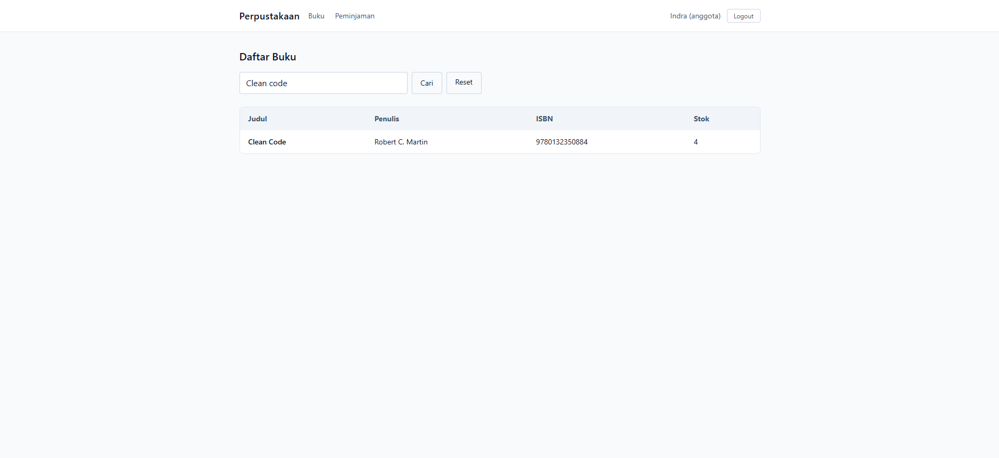

**Status:** PASS

---

### TC-BOOK-03: Tambah Buku

**Prioritas:** High  
**Jenis:** Functional

**Kondisi Awal:**
- Login sebagai petugas.

**Langkah Uji:**
1. Buka halaman tambah buku.
2. Isi form dan simpan.

**Hasil yang Diharapkan:**
- Buku tersimpan dan muncul di daftar.

**Bukti:**
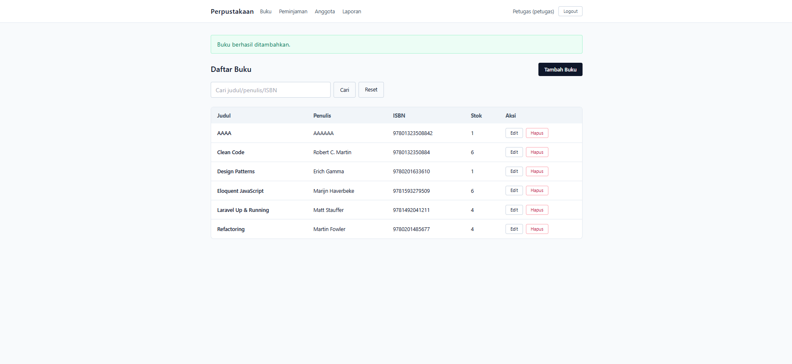

**Status:** PASS

---

### TC-BOOK-04: Edit Buku

**Prioritas:** High  
**Jenis:** Functional

**Kondisi Awal:**
- Login sebagai petugas.
- Buku tersedia.

**Langkah Uji:**
1. Klik Edit pada salah satu buku.
2. Ubah data, simpan.

**Hasil yang Diharapkan:**
- Data buku berubah.

**Bukti:**
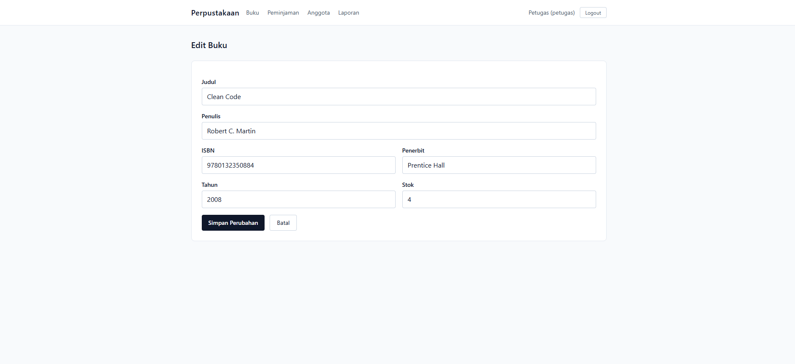
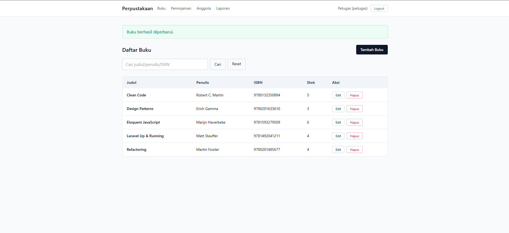

**Status:** PASS

---

### TC-BOOK-05: Hapus Buku

**Prioritas:** High  
**Jenis:** Functional

**Kondisi Awal:**
- Login sebagai petugas.

**Langkah Uji:**
1. Klik Hapus pada buku.

**Hasil yang Diharapkan:**
- Buku terhapus (jika tidak ada peminjaman aktif).

**Bukti:**
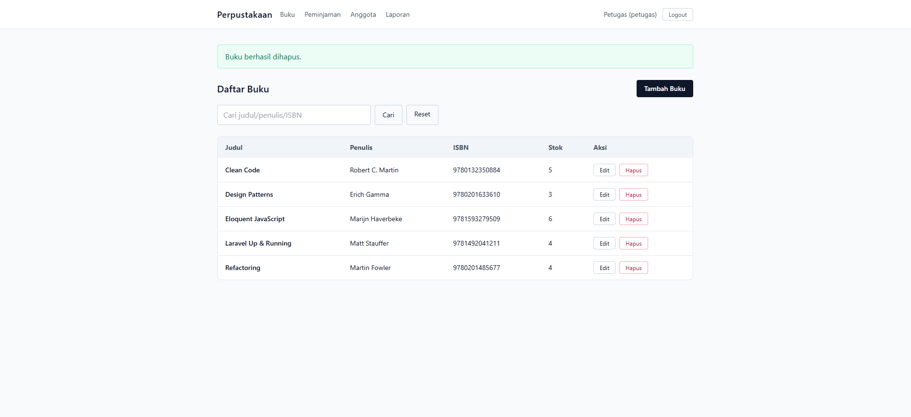
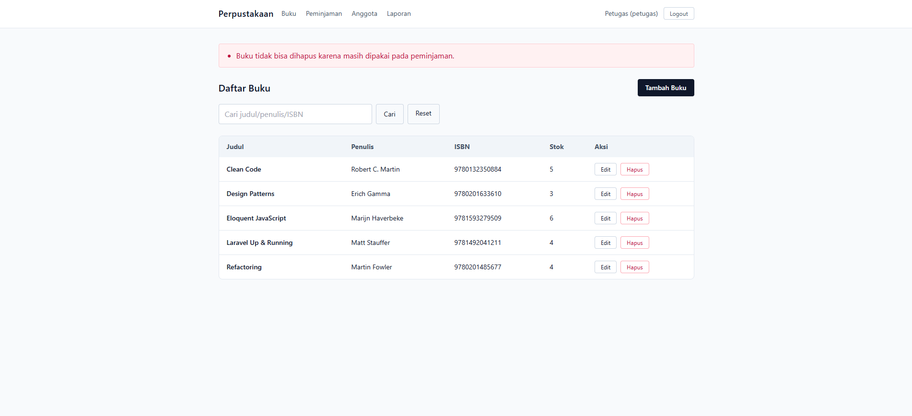

**Status:** PASS

---

### TC-LOAN-01: Catat Peminjaman (Petugas)

**Prioritas:** Critical  
**Jenis:** Functional

**Kondisi Awal:**
- Login petugas.
- Stok buku tersedia.

**Langkah Uji:**
1. Buka menu Peminjaman.
2. Klik "Catat Peminjaman".
3. Pilih anggota dan buku.
4. Simpan.

**Hasil yang Diharapkan:**
- Peminjaman tercatat.
- Stok berkurang.

**Bukti:**

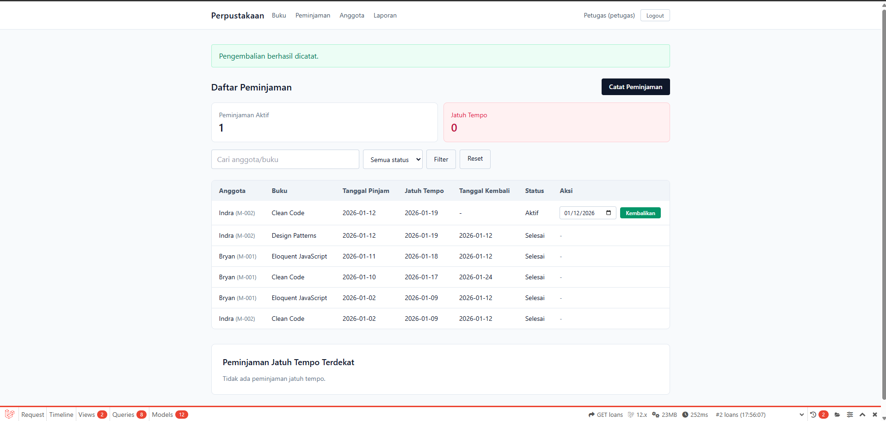

**Status:** PASS

---

### TC-LOAN-02: Validasi Peminjaman (Stok Habis)

**Prioritas:** High  
**Jenis:** Validation

**Kondisi Awal:**
- Stok buku = 0.

**Langkah Uji:**
1. Coba catat peminjaman untuk buku tersebut.

**Hasil yang Diharapkan:**
- Muncul pesan error stok habis.

**Bukti:**
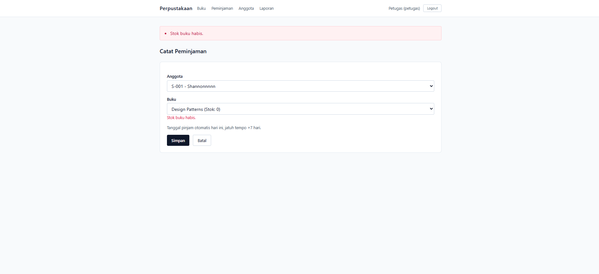

**Status:** PASS

---

### TC-LOAN-03: Daftar Peminjaman (Petugas)

**Prioritas:** High  
**Jenis:** Functional

**Kondisi Awal:**
- Data peminjaman tersedia.

**Langkah Uji:**
1. Buka menu Peminjaman.

**Hasil yang Diharapkan:**
- Daftar peminjaman tampil.

**Bukti:**

**Status:** PASS

---

### TC-LOAN-04: Filter Status

**Prioritas:** Medium  
**Jenis:** Functional

**Kondisi Awal:**
- Data peminjaman memiliki status berbeda.

**Langkah Uji:**
1. Pilih filter status.
2. Klik Filter.

**Hasil yang Diharapkan:**
- Daftar menampilkan status sesuai filter.

**Bukti:**
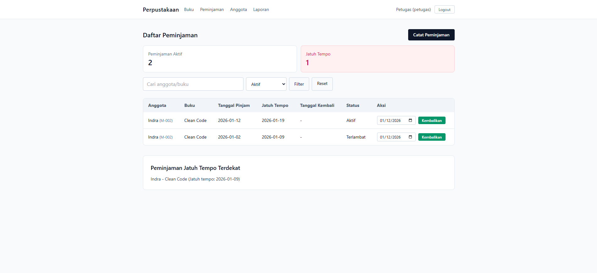
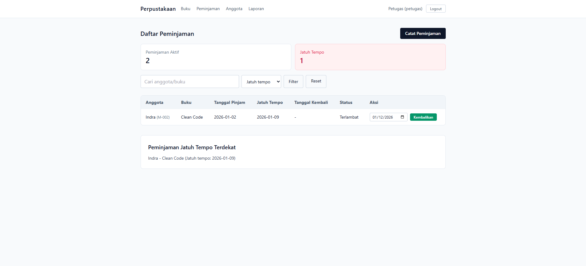
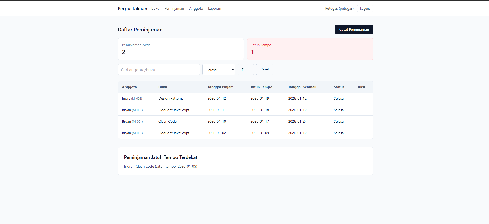

**Status:** PASS

---

### TC-LOAN-05: Pengembalian Buku

**Prioritas:** Critical  
**Jenis:** Functional

**Kondisi Awal:**
- Ada peminjaman aktif.

**Langkah Uji:**
1. Klik "Kembalikan".

**Hasil yang Diharapkan:**
- Status menjadi selesai.
- Tanggal kembali terisi.

**Bukti:**

**Status:** PASS

---

### TC-LOAN-06: Stok Bertambah Setelah Pengembalian

**Prioritas:** High  
**Jenis:** Functional

**Kondisi Awal:**
- Ada peminjaman aktif.

**Langkah Uji:**
1. Lakukan pengembalian.
2. Cek stok buku.

**Hasil yang Diharapkan:**
- Stok bertambah.

**Bukti:**

**Status:** PASS

---

### TC-LOAN-07: Daftar Peminjaman Anggota

**Prioritas:** High  
**Jenis:** Functional

**Kondisi Awal:**
- Login sebagai anggota.

**Langkah Uji:**
1. Buka menu Peminjaman.

**Hasil yang Diharapkan:**
- Anggota hanya melihat peminjaman miliknya.

**Bukti:**
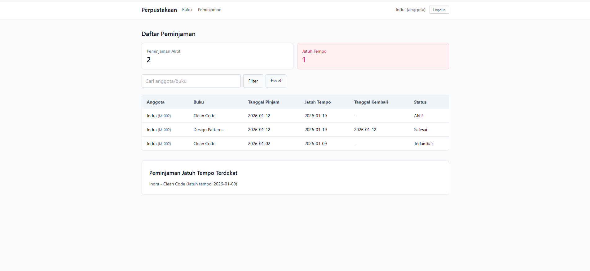
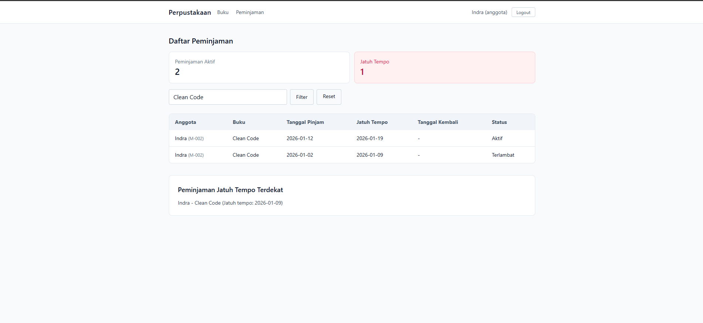

**Status:** PASS

---

### TC-LOAN-08: Laporan Peminjaman (Petugas)

**Prioritas:** Medium  
**Jenis:** Functional

**Kondisi Awal:**
- Login sebagai petugas.

**Langkah Uji:**
1. Buka menu Laporan.

**Hasil yang Diharapkan:**
- Laporan peminjaman aktif/terlambat tampil.

**Bukti:**

**Status:** PASS

---

### TC-MEMBER-01: Lihat Daftar Anggota

**Prioritas:** Medium  
**Jenis:** Functional

**Kondisi Awal:**
- Login petugas.

**Langkah Uji:**
1. Buka menu Anggota.

**Hasil yang Diharapkan:**
- Daftar anggota tampil.

**Bukti:**

**Status:** PASS

---

### TC-MEMBER-02: Cari Anggota

**Prioritas:** Medium  
**Jenis:** Functional

**Kondisi Awal:**
- Ada data anggota.

**Langkah Uji:**
1. Ketik kata kunci.
2. Klik Cari.

**Hasil yang Diharapkan:**
- Daftar terfilter sesuai kata kunci.

**Bukti:**

**Status:** PASS

---

### TC-MEMBER-03: Tambah Anggota

**Prioritas:** High  
**Jenis:** Functional

**Kondisi Awal:**
- Login petugas.

**Langkah Uji:**
1. Buka form tambah anggota.
2. Isi data dan simpan.

**Hasil yang Diharapkan:**
- Anggota tersimpan.

**Bukti:**
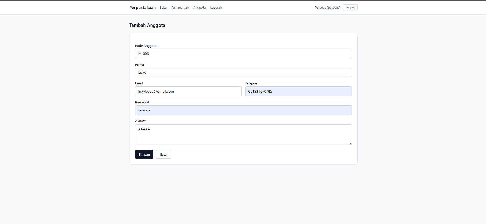
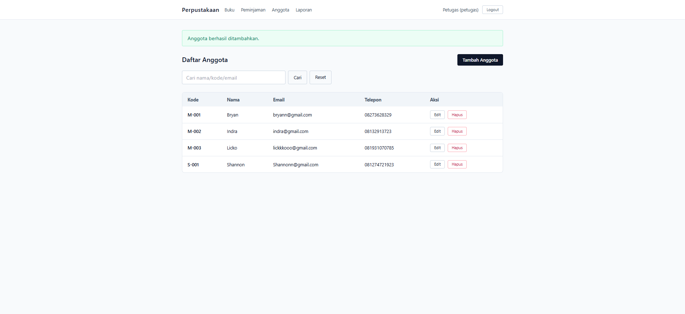

**Status:** PASS

---

### TC-MEMBER-04: Edit Anggota

**Prioritas:** High  
**Jenis:** Functional

**Kondisi Awal:**
- Login petugas.

**Langkah Uji:**
1. Klik Edit pada anggota.
2. Ubah data dan simpan.

**Hasil yang Diharapkan:**
- Data anggota berubah.

**Bukti:**
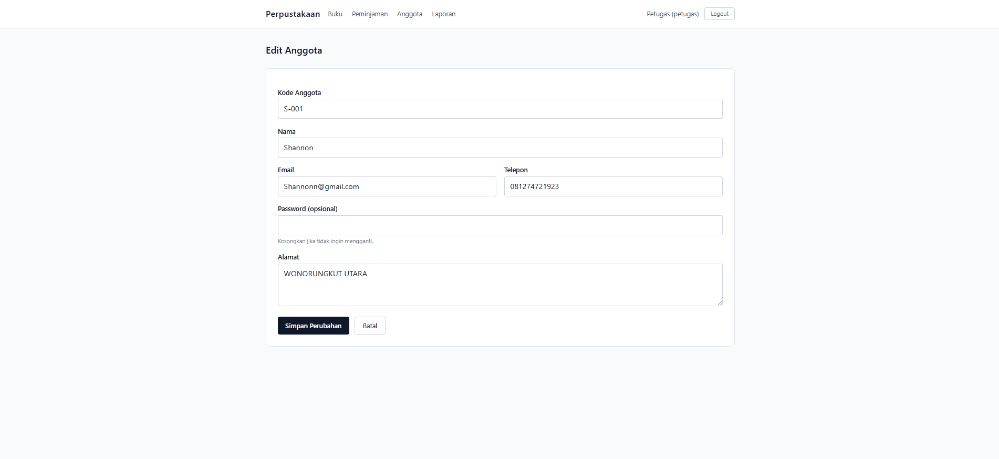
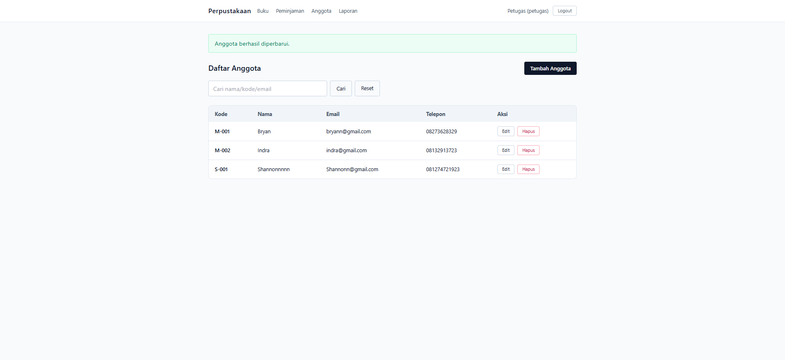

**Status:** PASS

---

### TC-MEMBER-05: Hapus Anggota

**Prioritas:** High  
**Jenis:** Functional

**Kondisi Awal:**
- Login petugas.

**Langkah Uji:**
1. Klik Hapus pada anggota.

**Hasil yang Diharapkan:**
- Anggota terhapus (jika tidak punya peminjaman aktif).

**Bukti:**
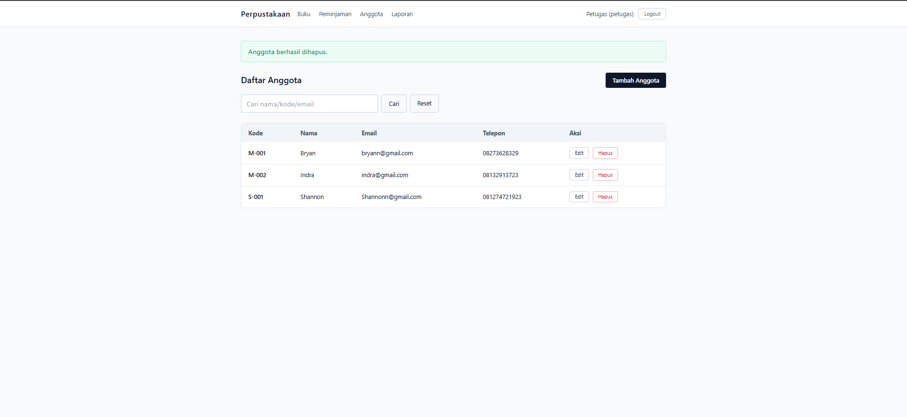

**Status:** PASS

---

### TC-REPORT-01: Laporan Peminjaman Aktif

**Prioritas:** Medium  
**Jenis:** Functional

**Kondisi Awal:**
- Login petugas.

**Langkah Uji:**
1. Buka laporan.

**Hasil yang Diharapkan:**
- Menampilkan peminjaman aktif.

**Bukti:**

**Status:** PASS

---

### TC-REPORT-02: Laporan Peminjaman Jatuh Tempo/Terlambat

**Prioritas:** Medium  
**Jenis:** Functional

**Kondisi Awal:**
- Login petugas.

**Langkah Uji:**
1. Buka laporan.

**Hasil yang Diharapkan:**
- Menampilkan peminjaman jatuh tempo/terlambat.

**Bukti:**

**Status:** PASS

---

### TC-BL-01: Due Date Otomatis +7 Hari

**Prioritas:** Critical  
**Jenis:** Business Logic

**Kondisi Awal:**
- Petugas login.
- Buku tersedia.

**Langkah Uji:**
1. Catat peminjaman.

**Hasil yang Diharapkan:**
- Due date = loan date + 7 hari.

**Bukti:**

**Status:** PASS

---

### TC-BL-02: Tanggal Kembali Tidak Boleh Sebelum Tanggal Pinjam

**Prioritas:** High  
**Jenis:** Business Logic

**Kondisi Awal:**
- Ada peminjaman aktif.

**Langkah Uji:**
1. Input tanggal kembali sebelum tanggal pinjam.
2. Simpan pengembalian.

**Hasil yang Diharapkan:**
- Sistem menolak input.
- Muncul pesan error.

**Bukti:**

**Status:** PASS

---

## Kesimpulan Uji

Semua test case di bawah dicatat sebagai lulus (PASS) berdasarkan bukti screenshot yang tersedia.
